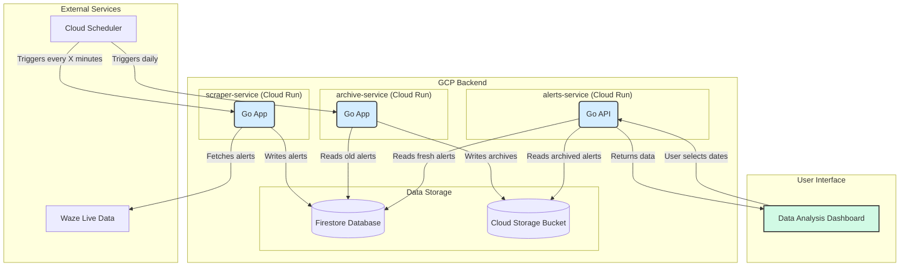

# System Architecture

This document provides a comprehensive overview of the Waze Police Scraper project's architecture, detailing its components, data flow, and technology stack.

---

## 1. High-Level Overview

This project is a cloud-native, event-driven system designed to scrape, store, and visualize police alert data from Waze. It follows a microservices architecture, with distinct services for data collection, data serving, and data archiving. The entire system is deployed on Google Cloud Platform and leverages serverless technologies for scalability and cost-efficiency.

The primary components are:
*   A **Scraper Service** that periodically fetches data from Waze.
*   A **Firestore Database** that serves as the central data store for fresh alerts.
*   An **Alerts Service** (API) that provides data to the frontend dashboard.
*   An **Archive Service** that moves older data to long-term storage.
*   A **Data Analysis Dashboard**, which is a vanilla JavaScript single-page application for visualization.

---

## 2. Architecture Diagram

The following diagram illustrates the flow of data and the interaction between the system's components.

---

## 3. Component Breakdown

### 3.1. Scraper Service (`scraper-service`)
*   **Technology**: Go, deployed on Cloud Run.
*   **Trigger**: Invoked by Google Cloud Scheduler on a fixed schedule (e.g., every 5 minutes).
*   **Responsibilities**:
    1.  Receives a trigger to begin a scrape cycle.
    2.  Makes HTTP requests to the Waze live data endpoints for predefined geographic bounding boxes.
    3.  Parses the JSON response to extract police-related alerts.
    4.  Performs data cleaning and transformation into a standardized `PoliceAlert` model.
    5.  Writes the processed alerts to the `police_alerts` collection in Firestore.

### 3.2. Alerts Service (`alerts-service`)
*   **Technology**: Go, deployed on Cloud Run.
*   **Trigger**: Publicly accessible HTTPS endpoint invoked by the frontend dashboard.
*   **Responsibilities**:
    1.  Receives a request from the frontend containing a list of dates.
    2.  For each date, it first checks if a pre-computed archive exists in Google Cloud Storage (GCS).
    3.  If an archive exists, it streams the data directly from the GCS file.
    4.  If no archive exists, it queries Firestore for alerts within that date's 24-hour UTC window.
    5.  Streams the results back to the frontend as a single, deduplicated JSONL stream.
    6.  Acts as a secure proxy, preventing direct database access from the browser.

### 3.3. Archive Service (`archive-service`)
*   **Technology**: Go, deployed on Cloud Run.
*   **Trigger**: Invoked by Google Cloud Scheduler on a daily schedule.
*   **Responsibilities**:
    1.  Receives a trigger to archive a specific day's data (e.g., yesterday).
    2.  Queries Firestore for all alerts published within that day's 24-hour UTC window.
    3.  Serializes the alerts into a JSONL file.
    4.  Uploads the resulting file to a Google Cloud Storage bucket for long-term, cost-effective storage.
    5.  (Future enhancement): Deletes the archived alerts from Firestore to reduce its size and cost.

### 3.4. Data Analysis Dashboard
*   **Technology**: Vanilla JavaScript (ES6), HTML5, CSS3, hosted on Firebase Hosting.
*   **Responsibilities**:
    1.  Provides a user interface for selecting dates and applying filters.
    2.  Constructs and sends API requests to the `alerts-service`.
    3.  Parses the streamed JSONL response and loads the data into memory.
    4.  Performs client-side filtering, sorting, and statistical calculations.
    5.  Renders the filtered alerts on an interactive map (Leaflet.js) and in a detailed list.

---

## 4. Core Technologies & Rationale

*   **Go**: Chosen for the backend services due to its high performance, low memory footprint (ideal for serverless environments), strong typing, and excellent support for concurrency, which is useful for handling multiple simultaneous requests.

*   **Google Cloud Run**: Selected as the compute platform for its serverless nature. It offers scale-to-zero capabilities, which is extremely cost-effective for services that are invoked periodically. It also provides a fully managed environment, simplifying deployment and operations.

*   **Google Cloud Firestore**: Used as the primary database for its ease of use, scalability, and real-time capabilities. Its document-based model is a good fit for the semi-structured nature of the alert data.

*   **Google Cloud Storage (GCS)**: Chosen for long-term archival storage due to its low cost and high durability. It is ideal for storing the immutable daily alert archives.

*   **Vanilla JavaScript**: Selected for the frontend to create a lightweight, fast, and dependency-free application. This approach avoids the need for a complex build pipeline and demonstrates strong foundational web development skills.

*   **GitHub Actions**: Used for CI/CD to automate the process of building, testing, and deploying the Go microservices to Cloud Run whenever code is pushed to the `main` branch.

---

## 5. Data Flow Lifecycle

1.  **Collection**: A Cloud Scheduler job triggers the `scraper-service`. The service fetches raw data from Waze, filters for police alerts, and stores them in Firestore.
2.  **Archival**: A separate daily Cloud Scheduler job triggers the `archive-service`. It reads the previous day's data from Firestore and writes it as a permanent `.jsonl` file to a GCS bucket.
3.  **Retrieval**: A user visits the dashboard and selects dates. The dashboard calls the `alerts-service` API.
4.  **Serving**: The `alerts-service` intelligently serves the data, preferring the cheap and fast GCS archives when available and falling back to live Firestore queries for the most recent data.
5.  **Visualization**: The dashboard receives the data stream and renders it for the user to analyze.
