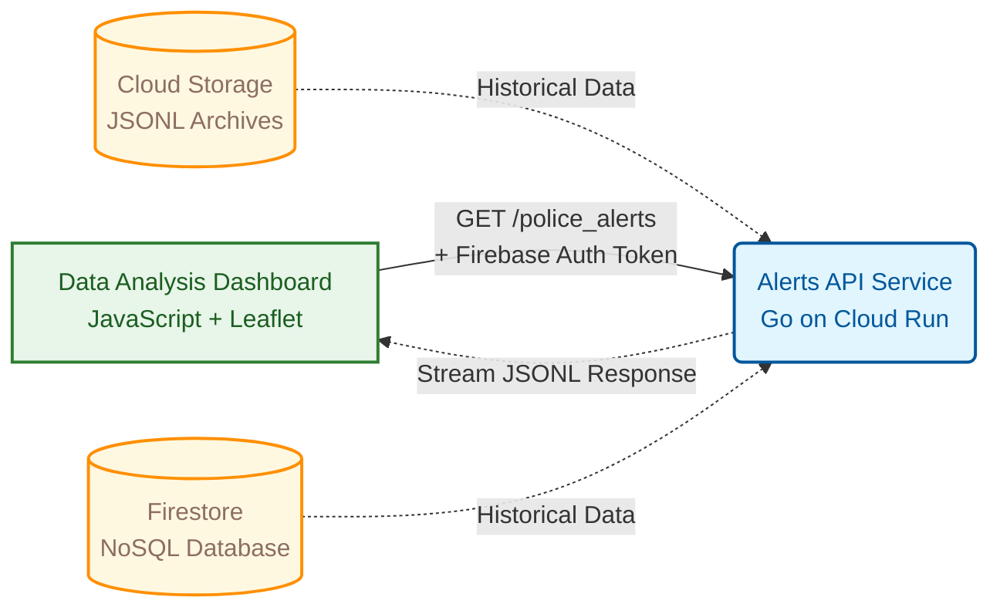
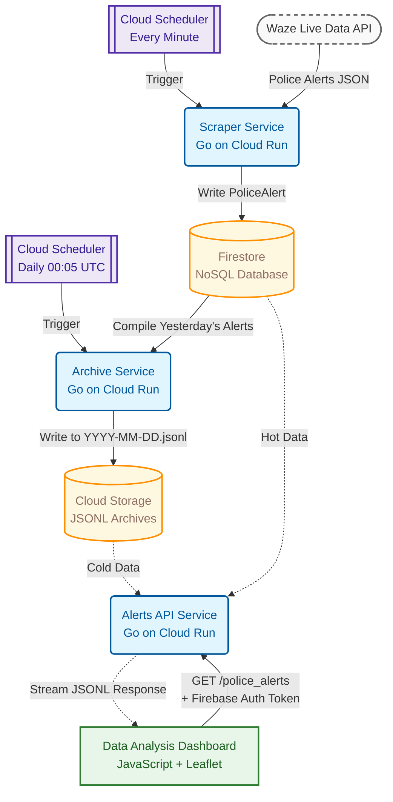

# System Architecture

---

## Current State (Post-Decommission, April 2026)

Data collection stopped on March 16, 2026 after the Waze API began returning 403 errors permanently (~January 10, 2026). The scraper and archive services have been decommissioned. Only the alerts service and frontend remain live, serving the historical dataset.

The original full architecture (scraper pipeline, archive pipeline) is documented below for reference.

---

## 1. High-Level Overview

Three microservices on Cloud Run: a scraper that collects from Waze every minute, an archive service that moves daily Firestore data to GCS, and an alerts API that serves the frontend. Infrastructure is on GCP (Cloud Run, Firestore, GCS, Cloud Scheduler), defined in Terraform.

---

## 2. Architecture Diagram

> **Note**: Mermaid diagrams render on GitHub natively. In VS Code, install "Markdown Preview Mermaid Support".

---

## 3. Component Breakdown

### 3.1. Scraper Service (`scraper-service`)
*   **Technology**: Go on Cloud Run.
*   **Trigger**: Cloud Scheduler every minute (`* * * * *`).
*   **Config**: Bounding boxes from `configs/bboxes.yaml` (override via `WAZE_BBOXES` env var).
*   **Responsibilities**:
    1.  Fetches from the Waze live data API for each bounding box.
    2.  Parses and filters for police-type alerts, deduplicates by UUID across boxes.
    3.  Transforms into `PoliceAlert` and writes to Firestore, tracking alert lifecycle (initial scrape vs. updates).

### 3.2. Alerts Service (`alerts-service`)
*   **Technology**: Go on Cloud Run.
*   **Trigger**: HTTPS endpoint, Firebase Anonymous Auth required.
*   **Responsibilities**:
    1.  Verifies Firebase ID token, enforces per-user token-bucket rate limiting (default 30 req/min).
    2.  Accepts up to 7 dates per request.
    3.  For each date: checks GCS for a pre-computed archive first, falls back to Firestore.
    4.  Fetches dates in parallel (7 worker goroutines), streams results as gzip-compressed JSONL, deduplicated by UUID.

### 3.3. Archive Service (`archive-service`)
*   **Technology**: Go on Cloud Run.
*   **Trigger**: Cloud Scheduler daily at 00:05 UTC (`5 0 * * *`).
*   **Timezone**: Australia/Canberra for day boundaries.
*   **Responsibilities**:
    1.  Queries Firestore for the previous day's alerts.
    2.  Serializes to JSONL and uploads to GCS as `archives/YYYY-MM-DD.jsonl`.
    3.  Idempotent — skips dates already archived.

### 3.4. Data Analysis Dashboard
*   **Technology**: Vanilla JavaScript (ES6), HTML5, CSS3, hosted on Firebase Hosting.
*   **Responsibilities**:
    1.  Signs in anonymously via Firebase Auth and manages token refresh.
    2.  Sends authenticated requests to `alerts-service`, parses the streamed JSONL response.
    3.  Client-side filtering and sorting by subtype and street.
    4.  Renders alerts on a Leaflet.js map with a timeline plugin for lifespan visualization.

### 3.5. Supporting Infrastructure
*   **Artifact Registry**: Docker images for all Cloud Run services.
*   **BigQuery**: Provisioned for potential future analytics; unused.

---

## 4. Core Technologies & Rationale

*   **Go**: Low memory footprint suits Cloud Run's scale-to-zero model; good concurrency primitives for the parallel worker design in the alerts service.

*   **Cloud Run**: Scale-to-zero keeps costs near-zero for infrequently triggered services (scraper, archive).

*   **Firestore**: Document model fits the semi-structured Waze alert data; no schema migrations needed as fields evolved.

*   **GCS**: Cheap archival storage. Pre-computing daily JSONL archives offloads repeated Firestore queries to flat file reads.

*   **Vanilla JS**: No build pipeline, no framework overhead. Business logic is extracted into modules tested with Vitest.

*   **GitHub Actions**: Reusable workflow template keeps the three service pipelines consistent and DRY.

*   **Terraform**: All GCP resources declarative; decommissioning services meant deleting modules, not manual console clicks.

*   **Firebase Anonymous Auth**: No registration friction for the dashboard user, while still giving the API a per-user identity for rate limiting.

---

## 5. Data Flow Lifecycle

1.  **Collection**: Cloud Scheduler → `scraper-service` → Firestore (every minute).
2.  **Archival**: Cloud Scheduler → `archive-service` → reads Firestore → writes `YYYY-MM-DD.jsonl` to GCS (daily).
3.  **Retrieval**: Dashboard selects dates → calls `alerts-service`.
4.  **Serving**: `alerts-service` checks GCS first, falls back to Firestore, streams gzip JSONL.
5.  **Rendering**: Dashboard parses stream, renders map + timeline.
